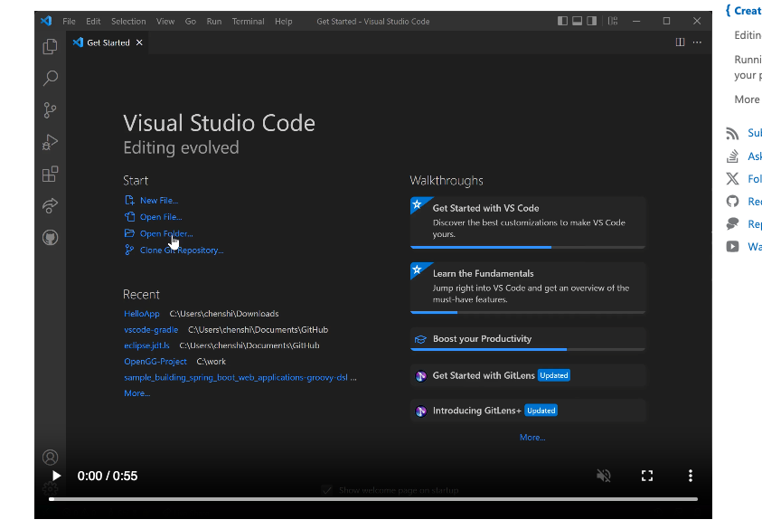
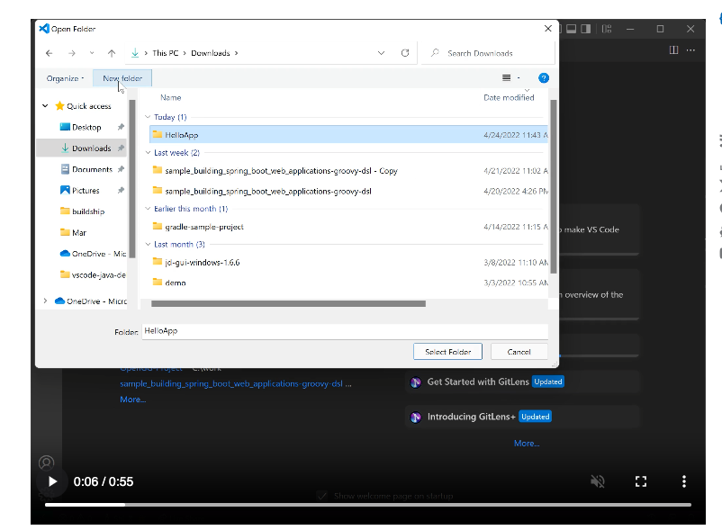
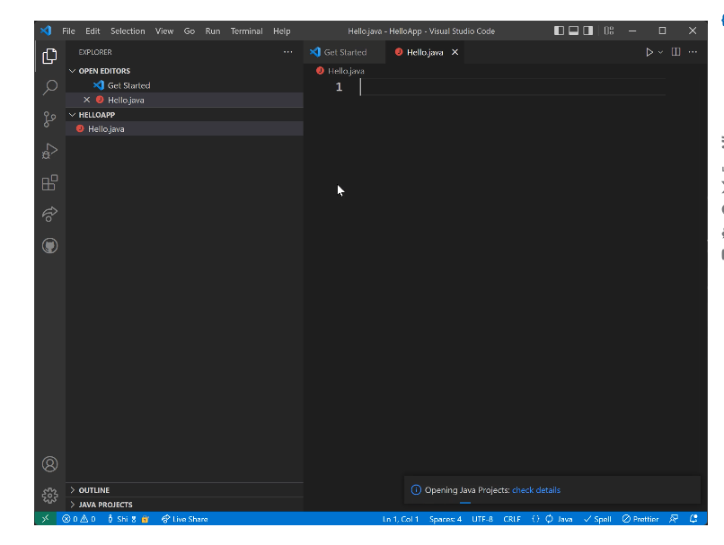
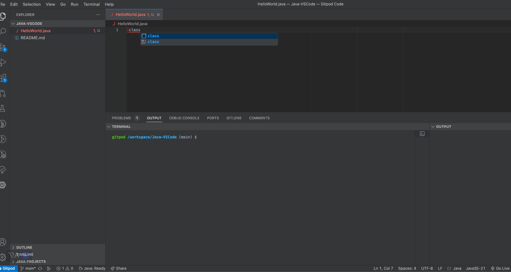
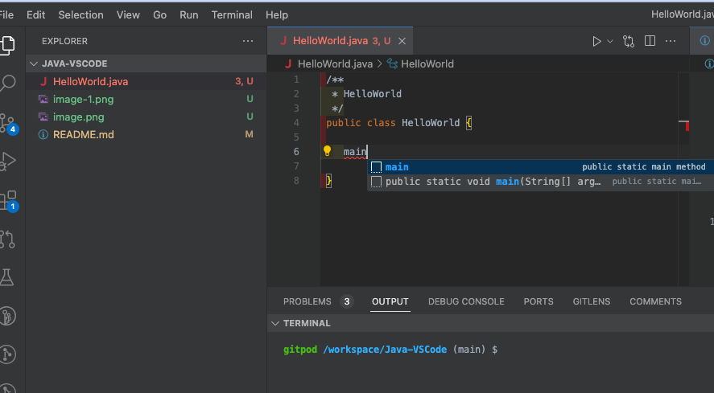
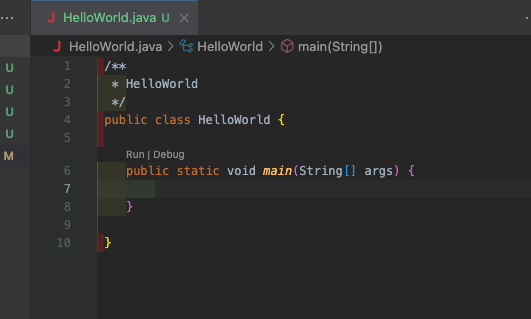
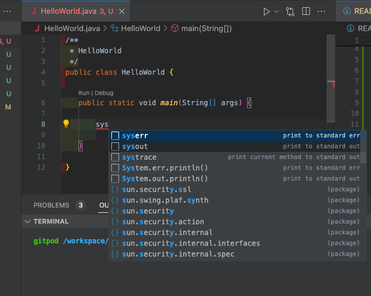
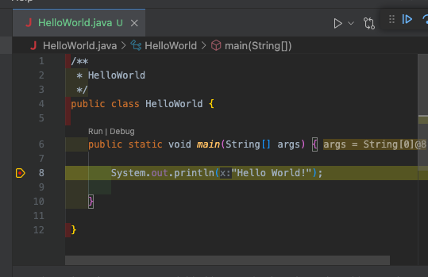

# Java-VSCode
https://code.visualstudio.com/docs/java/java-tutorial

### 00. Click on the Open Folder in VSCode

### 01. Create Folder in Windows Explore -> "HelloApp" and Select the HelloApp Folder, OPEN FOLDER FROM VS CODE

### 02. VS Code showcasing HelloApp Folder. Now create HelloWorld.java file - as show in the image

### 03.  type keyworld class select the class[]  and click on enter

### 04.  Now the VS Code is showcasing the HelloWorld class - with skeleton code.

### 05. Type main and select the main from the list and click enter

### 06. main method is created as part of the class

### 07. type sys and this will show case all the methods starting with sys. Select sysout

### 07. Java Sys Out method is created and now enter HelloWorld in quotes

### 08. Now you have option to run and debug. You click on Debug on the line 8 to create debug point and when you click on debug link, 
it will automatically stop at the line 8.

